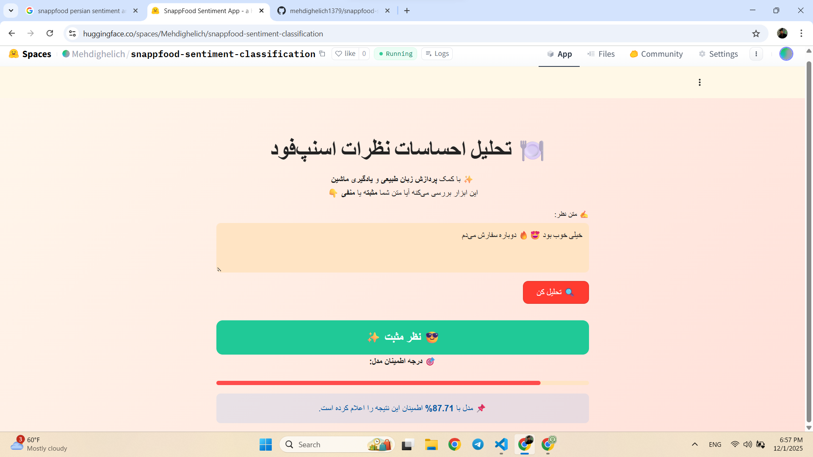

# 🍽️ تحلیل احساسات نظرات اسنپ‌فود (SnappFood Sentiment Analysis)

این پروژه یک سیستم تحلیل احساسات فارسی است که روی نظرات کاربران **اسنپ‌فود** آموزش داده شده.
مدل با استفاده از تکنیک‌های **پردازش زبان طبیعی (NLP)** و الگوریتم **Logistic Regression** ساخته شده و می‌تواند تشخیص دهد که متن ورودی **مثبت** است یا **منفی** و همچنین میزان اطمینان مدل را نمایش دهد.

---

## 🚀 نسخه آنلاین

برای تست آنلاین و بدون نیاز به نصب، وارد لینک زیر شوید:

🔗 **https://huggingface.co/spaces/Mehdighelich/snappfood-sentiment**

### 🎥 دموی برنامه

---

## 🧠 مدل و روش کار

- مدل یادگیری ماشین: **Logistic Regression**
- زبان: **فارسی**
- روش بردارسازی متن: **TF-IDF**
- ابزار NLP فارسی: **Hazm**
- رابط کاربری: **Streamlit**
- محل اجرای نهایی: **Hugging Face Spaces**

---

## 📊 نتایج ارزیابی مدل

| بخش                     | Accuracy | Precision | Recall | F1-Score | AUC    |
| ----------------------- | -------- | --------- | ------ | -------- | ------ |
| آموزش (Train)           | 0.8917   | 0.8590    | 0.9355 | 0.8956   | 0.9570 |
| اعتبارسنجی (Validation) | 0.8589   | 0.8226    | 0.9131 | 0.8655   | 0.9286 |
| تست (Test)              | 0.8596   | 0.8326    | 0.9026 | 0.8662   | 0.9244 |

🔹 نتیجه: با وجود اینکه مدل ساده است، عملکرد بسیار قابل قبول و متعادلی دارد.

---

## 🛠️ تکنولوژی‌های مورد استفاده

| بخش         | ابزار               |
| ----------- | ------------------- |
| NLP فارسی   | `hazm`              |
| مدل (ML, DL) | `Logistic Regression & LSTM`|
| رابط کاربری | `streamlit`         |
| ذخیره مدل   | `joblib`            |
| Deployment  | Hugging Face Spaces |

